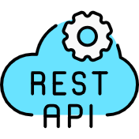
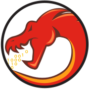

<!-- Dark theme optimized header with custom styling -->
<div align="center">
  
</div>

<!-- Introduction Section -->
<h3 align="center">💼 Upcoming Summer Analyst Intern @Goldman Sachs </h3>
 <h3 align="center">🎓 Prefinal-year B.Tech student at Indian Institute of Technology (ISM), Dhanbad. </h3>
<h3 align="center">💻 A passionate developer focused on Mern Stack Development, DevOps & Cybersecurity</h3>

---

# 🛠️ Technical Skills & Technologies

## 💻 Programming Languages
<p align="left">
<a href="https://www.cplusplus.com/" target="_blank">

</a>
<a href="https://developer.mozilla.org/en-US/docs/Web/JavaScript">

</a>
<a href="https://www.python.org">

</a>
<a href="https://www.java.com">

</a>
</p>

## 🚀 Frontend Development
<p align="left">
<a href="https://nextjs.org/">

</a>
<a href="https://reactjs.org/">

</a>
<a href="https://www.w3.org/html/">

</a>
<a href="https://www.w3schools.com/css/">

</a>
<a href="https://redux.js.org">

</a>
<a href="https://tailwindcss.com/">

</a>
</p>

## 🛠️ Backend Development
<p align="left">
<a href="https://nodejs.org">

</a>
<a href="https://expressjs.com">

</a>
<a href="https://jwt.io/">

</a>
<a href="https://www.geeksforgeeks.org/rest-api-introduction/">

</a>
</p>

## 🗄️ Databases
<p align="left">
<a href="https://www.mongodb.com/">

</a>
<a href="https://www.mysql.com/">

</a>
<a href="https://firebase.google.com/">

</a>
</p>

## ☁️ DevOps & Cloud Tools
<p align="left">
<a href="https://aws.amazon.com">

</a>
<a href="https://www.docker.com/">

</a>
<a href="https://kubernetes.io">

</a>
<a href="https://www.vagrantup.com/">

</a>
</p>

## 🔧 Development Tools
<p align="left">
<a href="https://git-scm.com/">

</a>
<a href="https://github.com/">

</a>
<a href="https://code.visualstudio.com/">

</a>
<a href="https://postman.com">

</a>
</p>

## 💻 Operating Systems
<p align="left">
<a href="https://www.linux.org/">

</a>
<a href="https://ubuntu.com/">

</a>
</p>

## 🔒 Cybersecurity Tools & Skills
<p align="left">
<a href="https://www.kali.org/">

</a>
<a href="https://en.wikipedia.org/wiki/Bash_(Unix_shell)">

</a>
<a href="https://www.wireshark.org/">

</a>
<a href="https://ghidra-sre.org/">

</a>
<a href="https://portswigger.net/burp/">

</a>
</p>

## 🧠 Core Programming Skills
```text
⚡ Data Structures & Algorithms
  ├─ Data Structures
  ├─ Algorithm
  ├─ Competitive Programming
  └─ Problem-Solving Techniques

🎯 Software Architecture
  ├─ Object-Oriented Programming (OOP)
  └─ MVC Architecture

```

## 🛡️ Cybersecurity Expertise
```text
🔐 Security
  ├─ Penetration Testing
  ├─ Bash Scripting
  ├─ Cryptography
  ├─ OWASP Top 10
  ├─ Web Exploitation
  ├─ SQL Injection Prevention
  └─ Network Security


🔧 Security Tools
  ├─ Burp Suite
  ├─ Wireshark
  ├─ Ghidra
  └─ Nmap
```

## 📊 GitHub Stats

<!-- GitHub Stats Cards with Dark Theme -->
<p align="center">

</p>

<p align="center">

</p>

<p align="center">

</p>

<!-- GitHub Activity Graph -->
<p align="center">

</p>


---

## 🏆 Achievements

- **SIH-2023** - Top 3 team at college's internal hackathon.
- **Winter of Code 5.0 Winner** - Cyberlabs Hackathon, IIT(ISM) Dhanbad.
- **Global Rank 215** - CodeChef Starters 128.
- Solved **600+ problems** in DSA across various coding platforms.

---

## 🎯 Positions of Responsibility

- **Organizing Member** - PearlCTF 2024
- **Counseling Head** - Mentored 100+ students from GUS100 Kanpur for JEE.
- **Member** - CYBERLABS (Data & Software Technology Club)
- **Member** - LightsCameraISM (Filmmaking Club)

---


## 🌐 Connect with me
<p align="left">
<a href="https://www.linkedin.com/in/adarsh40parihar/" target="_blank">

</a>
<a href="https://github.com/adarsh40parihar" target="_blank">

</a>
<a href="mailto:adarshparihar2540@gmail.com">

</a>
</p>

<!-- Footer -->
<p align="center">

</p>

<!-- Snake Animation -->
<p align="center">

</p>
